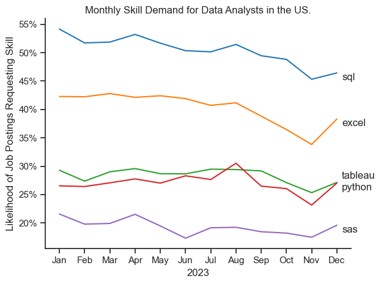

# The Analysis

## 1. What are the most in-demand skills for the 3 most popular data jobs?

I identified the top five most in-demand skills for the three most popular data job titles in the United States.  This analysis highlights key skills associated with these roles and helps guide job-seekers on which skills to prioritise based on their target position.

View my notebook with detailed steps here: 
[2_Skill_Count.ipynb](2_Data_Analytics_Project/2_Skills_Count.ipynb)

### Data Visualisation

```python
fig, ax = plt.subplots(len(job_titles), 1)

for i, job_title in enumerate(job_titles):
    df_job_skills = df_skills_count[df_skills_count['job_title_short'] == job_title].head(5)
    df_job_skills['skill_percentage'] = df_job_skills['skill_count'] / len(df_US[df_US['job_title_short'] == job_title]) * 100
    sns.barplot(data=df_job_skills, x='skill_percentage', y='job_skills', ax=ax[i], hue='skill_percentage', palette='dark:b_r')

    plt.show()
```

### Results


### Insights 
- Python is a versatile and highly in-demand skill across all three major data roles. It is most prominently required for Data Scientists (72% of job postings) and Data Engineers (65%), compared to Data Analysts (27%).

- SQL is the most requested skill for Data Analysts (50%) and Data Engineers (68%). For Data Scientists, Python takes the lead, appearing in over 72% of job postings.

- Data Engineers tend to require more specialized technical skills such as AWS, Azure, and Spark, while Data Analysts and Data Scientists are expected to be proficient in more general data analysis and management tools like R, Excel, and Tableau.- 

## 2. How do in-demand skills trending for Data Analysts?

I selected the five most popular skills for data analysts and examined their presence in job postings throughout 2023. This analysis highlights which skills are rising or declining in demand, helping job seekers prioritize their learning based on current industry trends.

### Data Visualisation

``` python
sns.lineplot(data=df_percent[top_5_skills], dashes=False, palette='tab10')

plt.show()
```

### Results


### Insights
- 1. SQL remains the most popular tool for Data Analysts, but its demand has been gradually declining over time.
- 2. Excel experienced a significant increase in demand around November, reversing its earlier downward trend.
- 3. Python, Tableau, and SAS showed relatively stable demand throughout 2023, with only minor fluctuations. They continue to be essential skills for data analytics.

## 3. How well do jobs and skills pay for Data Analysts?

### What are the expected salaries for popular data roles?

I visualized the expected salaries for three data roles, Data Analyst, Data Scientist, and Data Engineer, at both junior and senior levels in the United States. This analysis can help job seekers better understand potential earnings and plan their future career trajectories within the data field.

### Data Visualisation

```python
sns.boxplot(data=df_filtered, x='salary_year_avg', y='job_title_short', order=job_order)

plt.show()
```

### Results


### Insights
- 1. Data Scientists are expected to earn more than both Data Engineers and Data Analysts.
- 2. Senior-level data roles offer higher salaries than their respective junior-level positions, as expected.
- 3. Senior Data Analysts have a lower expected salary compared to Junior Data Scientists and Junior Data Engineers


