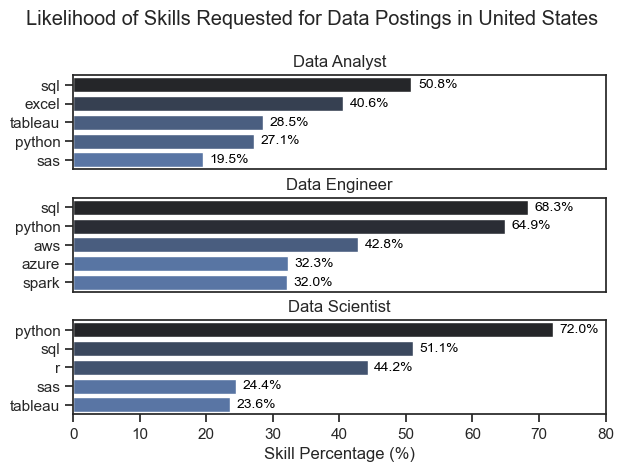
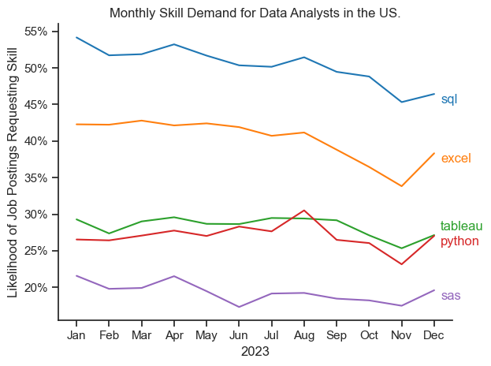
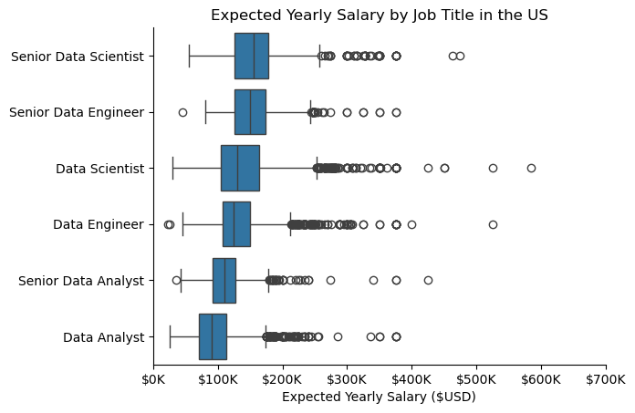
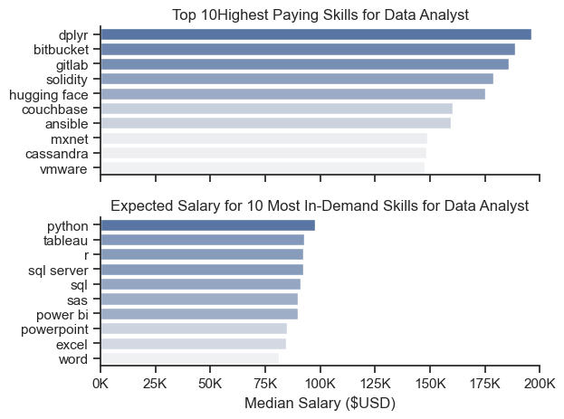
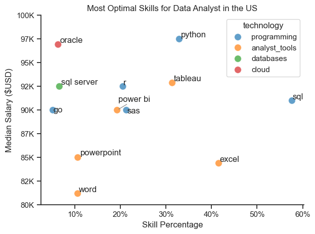

# The Overview
Welcome to my analysis. This project analyzed the U.S. job market for Data Analysts using 2023 job posting data. It delves into the top-paying and in-demand skills to help identify optimal job oppurtunties for Data Analysts.


The dataset was sourced from [Luke Barousse's Python course](https://www.youtube.com/watch?v=wUSDVGivd-8) and contains detailed information on job titles, required skills, and salary ranges. Using a series of Python scripts, I investigated key questions around skill demand, salary trends, and the intersection between market demand and pay in data analytics.

# The Questions

Below are the question I answer in my project:

1. What are the most in-demand skills for the 3 most popular data jobs?
2. How do in-demand skills trending for Data Analysts?
3. How well do Data Analyst's get paid compared to other data roles, and based on their skills?
4. What are the most optimal skills to know for a Data Analyst.

# Tools I Used
- Python – The backbone of my analysis, enabling me to process data and uncover critical insights.  
  I used the following Python libraries:  
    - Pandas – For data cleaning, manipulation, and analysis.  
    - Matplotlib – For creating visualizations.  
    - Seaborn – For enhancing the style and clarity of visualizations.  


- Jupyter Notebook – To run Python scripts while integrating notes, code, and outputs in a single, interactive environment.

- Visual Studio Code – My primary editor for writing and executing Python scripts.

- Git & GitHub – For version control and sharing my Python code and analysis.

# The Analysis

## 1. What are the most in-demand skills for the 3 most popular data jobs?

I identified the top five most in-demand skills for the three most popular data job titles in the United States.  This analysis highlights key skills associated with these roles and helps guide job-seekers on which skills to prioritise based on their target position.

View my notebook with detailed steps here: 
[2_Skill_Count.ipynb](2_Data_Analytics_Project/2_Skills_Count.ipynb)

### Data Visualisation

```python
fig, ax = plt.subplots(len(job_titles), 1)

for i, job_title in enumerate(job_titles):
    df_job_skills = df_skills_count[df_skills_count['job_title_short'] == job_title].head(5)
    df_job_skills['skill_percentage'] = df_job_skills['skill_count'] / len(df_US[df_US['job_title_short'] == job_title]) * 100
    sns.barplot(data=df_job_skills, x='skill_percentage', y='job_skills', ax=ax[i], hue='skill_percentage', palette='dark:b_r')

    plt.show()
```

### Results



### Insights 
- 1. Python is a versatile and highly in-demand skill across all three major data roles. It is most prominently required for Data Scientists (72% of job postings) and Data Engineers (65%), compared to Data Analysts (27%).
- 2. SQL is the most requested skill for Data Analysts (50%) and Data Engineers (68%). For Data Scientists, Python takes the lead, appearing in over 72% of job postings.
- 3. Data Engineers tend to require more specialized technical skills such as AWS, Azure, and Spark, while Data Analysts and Data Scientists are expected to be proficient in more general data analysis and management tools like R, Excel, and Tableau.- 

## 2. How do in-demand skills trending for Data Analysts?

I selected the five most popular skills for data analysts and examined their presence in job postings throughout 2023. This analysis highlights which skills are rising or declining in demand, helping job seekers prioritize their learning based on current industry trends.

### Data Visualisation

``` python
sns.lineplot(data=df_percent[top_5_skills], dashes=False, palette='tab10')

plt.show()
```

### Results


### Insights
- 1. SQL remains the most popular tool for Data Analysts, but its demand has been gradually declining over time.
- 2. Excel experienced a significant increase in demand around November, reversing its earlier downward trend.
- 3. Python, Tableau, and SAS showed relatively stable demand throughout 2023, with only minor fluctuations. They continue to be essential skills for data analytics.

## 3. How well do Data Analyst's get paid compared to other data roles and based on their skills?

### What are the expected salaries of Data analyst compare to other popular data roles

I visualized the expected salaries for three data roles, Data Analyst, Data Scientist, and Data Engineer, at both junior and senior levels in the United States. This analysis can help Data Analysts better understand potential earnings and plan their future career trajectories within the data field.

### Data Visualisation

```python
sns.boxplot(data=df_filtered, x='salary_year_avg', y='job_title_short', order=job_order)

plt.show()
```

### Results


### Insights
- 1. Senior-level data roles offer higher salaries than their respective junior-level positions, as expected.
- 2. Data Scientists are expected to earn more than both Data Engineers and Data Analysts
- 3. Senior Data Analysts have a lower expected salary compared to Junior Data Scientists and Junior Data Engineers

### How do Data Analysts Get Paid Based on Their Skills?

I visualised the expected salaries for top-paying skills and most in-demand skills among Data Analysts. This can help both current and aspiring Data Analysts prioritise which skills to learn for maximum career and salary impact.

### Data Visualisation

```python

fig, ax = plt.subplots(2,1)

for i, col in enumerate(df_median_count):
    if col == 'median_salary':
        df_plot = df_median_count.sort_values(by=col, ascending=False).head(10)
    else:
        df_plot = df_median_count.sort_values(by=col, ascending=False).head(10).sort_values(by='median_salary', ascending=False)
    sns.barplot(data=df_plot, x=df_plot['median_salary'], y=df_plot.index, ax=ax[i], hue='median_salary', palette='light:b')

plt.show()
``` 

### Results 


### Insights
- 1. The top chart shows that specialised skills such as 'dplyr', 'gitlab', and 'hugging face' are associated with higher salaries, in some cases reaching up to $200K. This suggests that advanced technical skills can significantly increase a Data Analyst’s earning potential.

- 2. Foundational skills like 'Excel', 'PowerPoint', and 'SQL' remain highly in demand but are not linked to the highest salaries. This highlights their importance for securing data analysis roles, even if they do not directly command top pay.

- 3. There is a clear gap between the salaries of the highest-paying skills and the most in-demand skills. To maximise earning potential, it’s beneficial to develop a diverse skill set that includes both high-demand foundational skills and specialised high-paying skills. 

## 4. What are the most optimal skills to know for a Data Analyst.

I visualised the most optimal skills for Data Analysts based on demand and expected salary, providing job seekers with guidance on prioritising skills that are both in high demand and offer competitive pay.

### Data Visualisation

```python
sns.scatterplot(data=df_plot, x='skill_percentage', y='median_salary', hue='technology', palette='tab10', s=100, alpha=0.7)

plt.show()
```

### Results



### Insights

- 1. Programming tools like 'Python' and 'SQL' are among the most valuable skills for Data Analysts. 'Python' in particular is important, as it is both in high demand and associated with higher salaries.
- 2. Traditional data analysis/visualisation tools such as 'PowerPoint' and 'Word' tend to be low-demand and low-salary, while 'Excel' remains high-demand but low-salary. In contrast, powerful visualisation tools like 'Power BI' and 'Tableau' are more in demand and offer better pay. Learning one of these can significantly boost earning potential.
- 3. Cloud computing and database tools such as 'Oracle' and 'SQL Server' tend to pay well but are not as highly sought after. These skills are best learned after mastering 'Python' and 'Tableau'. 

# What I Learned

Throughout this project, I deepened my understanding of the data job market and enhanced my technical skills in Python, especially in data wrangling and visualisation. Here are a few specific things I learned:

- **Advanced Python Usage** – Utilising libraries such as Pandas for data wrangling, and Seaborn and Matplotlib for data visualisation, along with other Python libraries, made it easier to perform complex analyses.  
- **Importance of Data Wrangling** – I learned that there are multiple ways to wrangle data in Python, each with its advantages and drawbacks, and that it’s important to create workflows best suited for the specific analysis at hand.  
- **Strategic Skill Analysis** – This project emphasised the importance of aligning one’s skills with market demand. Python and powerful data visualisation techniques are among the most optimal skills for Data Analysts in 2025.  

# Challenges I Faced:

The project was not without challenges, but it provided valuable learning opportunities:

- **Data Inconsistencies** – Handling missing or inconsistent data entries required careful consideration and thorough techniques to ensure the integrity of the analysis.  
- **Effective Data Visualisation** – Creating plots from a large, messy dataset that could speak for themselves was challenging. I often had to address overlaps and clutter to ensure insights were conveyed clearly.  

# Conclusion

This project provided a comprehensive look at the U.S. job market for Data Analysts in 2023, combining skill demand, salary trends, and optimal skill strategies. Through detailed analysis and visualisation, I was able to identify the most in-demand skills, track how these skills are trending over time, and understand how specific skills impact earning potential.  

Key takeaways include:  

- **Python and SQL** remain foundational and highly valuable for Data Analysts in 2025, offering both high demand and competitive salaries.  
- **Specialized skills** such as advanced data visualisation and cloud computing can significantly increase earning potential, even if they are less common in job postings.    
- **Strategic skill alignment** is essential: balancing foundational, in-demand skills with higher-paying specialized skills can maximize both career opportunities and salary growth.  

Overall, this analysis strengthened my technical skills in Python and data visualisation while providing practical insights into the data analytics job market, helping both aspiring and current Data Analysts make informed decisions about which skills to develop and prioritize.


